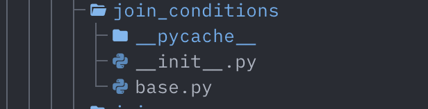
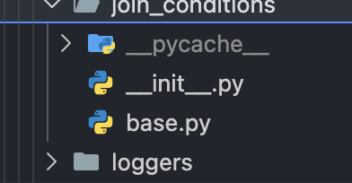

# svgtree.nvim

**Use your beloved VSCode SVG file icons — in full color — inside terminal Neovim.**

## The problem this solves

I've always been bothered that I can't use my favorite VSCode SVG file icons in Neovim.

Why can't we use svg icons in Neovim? Because terminals can't display SVG. So we're stuck with font glyphs, which can only render a boring one-color icon. The blue-and-yellow Python logo, the colorful Material icons, the whole VSCode look is impossible... until now.

svgtree.nvim fixes that. It renders the **actual SVG icons as real, full-color images**, welded to each line of the tree, using the Kitty graphics protocol. Install it and your VSCode icons show up in Neovim — no GUI required.

#### Before — font glyphs



#### After — real SVG icons



> ⚠️ **Experimental** proof-of-concept (it leans on Neovim's experimental `vim.ui.img` API). It's a working demo that VSCode-style icons are possible in a terminal, not yet a neo-tree replacement.

## Install

**Prerequisites** — the icons render only when all three are present. (If any is missing, svgtree degrades gracefully to text tags like `[python] foo.py`, so nothing breaks — you just don't get images.)

- **Neovim ≥ 0.13** — currently nightly. Install it and launch it as `nvim-nightly`.
- **A terminal that speaks the Kitty graphics protocol** — [Ghostty](https://ghostty.org/), [Kitty](https://sw.kovidgoyal.net/kitty/), or [WezTerm](https://wezfurlong.org/wezterm/).
- **An SVG → PNG converter** — `rsvg-convert` (recommended, renders fonts reliably): `brew install librsvg`. ImageMagick (`magick`) also works.

**The plugin** — with [lazy.nvim](https://github.com/folke/lazy.nvim), create a new file at `~/.config/nvim/lua/plugins/svgtree.lua` containing:

```lua
-- ~/.config/nvim/lua/plugins/svgtree.lua
return {
  "HundredBillion/svgtree.nvim",
  opts = {},
  cmd = { "SvgTree", "SvgTreeToggle" },
  keys = {
    { "<leader>t", "<cmd>SvgTreeToggle<cr>", desc = "Toggle svgtree" },
  },
}
```

(lazy.nvim auto-loads every `.lua` file under `~/.config/nvim/lua/plugins/`, so the filename is up to you — `svgtree.lua` just keeps things tidy.)

Out of the box you get a small bundled icon set. For the full Material or vscode-icons themes, see [Icon packs](#icon-packs) below.

## Use it

1. Open a project using the nightly Neovim variant:

   ```bash
   nvim-nightly .
   ```

2. Open the tree:

   ```vim
   :SvgTree
   ```

   Already using the snacks.nvim explorer? You don't need svgtree's tree —
   wire the adapter (see [Use the icon engine in snacks.nvim / neo-tree](#use-the-icon-engine-in-snacksnvim--neo-tree))
   and your icons appear in the explorer you already open (e.g. `<leader>e`).

3. **You should see your icons!**

If you see text tags (`[python] foo.py`) instead of images, run `:checkhealth svgtree` — it tells you exactly which prerequisite above is missing.

Inside the tree:

| Key | Action |
|---|---|
| `<CR>` / `l` | Expand/collapse a directory, or open a file |
| `h` | Collapse the directory under the cursor |
| `R` | Refresh |
| `q` | Close |

Commands: `:SvgTree [dir]` opens the tree (defaults to cwd); `:SvgTreeToggle [dir]` toggles it.

## Icon packs

svgtree reads **any VSCode file-icon theme directly** — it ships a small original starter set and otherwise reads a theme's own JSON in place. It stores no pack data of its own.

**Install a theme** (needs `curl` + `unzip`):

```bash
scripts/install-theme.sh PKief.material-icon-theme material
scripts/install-theme.sh vscode-icons-team.vscode-icons vscode-icons
```

These fetch the theme's `.vsix` from [Open VSX](https://open-vsx.org/) and unpack it to `stdpath('data')/svgtree/packs/<name>/`. Then select it:

```lua
require("svgtree").setup({ pack = "material" })
```

**Bring your own:** point `pack` at any unpacked VSCode icon-theme directory — including one already under `~/.vscode/extensions/`:

```lua
require("svgtree").setup({ pack = "/abs/path/to/an/unpacked/icon-theme" })
```

No import or conversion step — svgtree reads the theme's `iconDefinitions` plus its `fileExtensions`/`fileNames`/`folderNames` mappings directly. (VSCode `languageIds`, light/high-contrast variants, and font-based icons are not used.)

## Configuration

Defaults:

```lua
require("svgtree").setup({
  pack = nil,            -- nil = bundled set; a name = stdpath('data')/svgtree/packs/<name>; or an absolute pack dir
  icon = {
    width = 2,           -- icon footprint in cells
    height = 1,
    size_px = 40,        -- rasterized PNG size
    zindex = 50,
  },
  window = { width = 36, side = "left" },
  indent = 2,
  show_hidden = false,
  fallback_text = true,  -- show [id] tags when images are unavailable
})
```

## Use the icon engine in snacks.nvim / neo-tree / bufferline

svgtree's icon machinery is a **host-agnostic engine** you can attach to an existing explorer — or the bufferline tabline — to get real SVG icons there, no need to switch to svgtree's own tree. Call `require("svgtree").setup({})` once, then wire an adapter.

### snacks.nvim explorer

The adapter suppresses snacks' own glyph (keeping git/diagnostic decorations) and overlays an anchored image in its place.

```lua
-- lua/plugins/snacks.lua
opts = {
  picker = {
    sources = {
      explorer = {
        format  = require("svgtree.adapters.snacks").format,
        on_show = require("svgtree.adapters.snacks").on_show,
      },
    },
  },
}
```

### neo-tree.nvim (experimental)

```lua
require("neo-tree").setup({
  default_component_configs = {
    icon = { provider = function(icon)        -- blank neo-tree's glyph, keep width
      icon.text, icon.highlight = "  ", "NeoTreeFileIcon"
    end },
  },
  event_handlers = {
    { event = "after_render", handler = require("svgtree.adapters.neotree").on_render },
  },
})
-- If the icon lands a cell off, tune it:
-- require("svgtree.adapters.neotree").setup({ col_offset = 1 })
```

### bufferline.nvim (tabs)

Show each buffer's icon on its tab, matching the explorer. The tabline isn't a buffer, so this adapter doesn't use the overlay engine — it returns the icon as Kitty placeholder text + a highlight whose foreground colour carries the image id, via bufferline's `get_element_icon` hook.

```lua
-- lua/plugins/bufferline.lua
require("svgtree.adapters.bufferline").setup() -- once; pre-warms tab icons
opts = {
  options = {
    -- Required: the image id rides in the icon highlight's fg, so color_icons
    -- must stay on (color_icons = false forces fg = NONE and breaks the icon).
    color_icons = true,
    get_element_icon = function(element)
      -- Returns nil on stable nvim / non-graphics terminals, so bufferline
      -- falls back to its usual glyph (e.g. mini.icons / nvim-web-devicons).
      return require("svgtree.adapters.bufferline").get_element_icon(element)
    end,
  },
}
```

All three require the same prerequisites as the main tree. When they're unavailable, the adapters no-op and the host renders as usual.

## How it works

The hard part of putting an image in a text buffer is keeping it welded to its line: absolute screen placement (what [`vim.ui.img`](https://github.com/neovim/neovim/pull/37914) does) isn't anchored to text, so a redraw wipes it and a scroll leaves it behind. svgtree sidesteps that by drawing through the Kitty graphics protocol's **Unicode-placeholder** mechanism — each icon is transmitted once, then drawn as ordinary buffer cells the terminal paints the image over. Because the anchor *is* buffer text, the icon scrolls with its line and repaints on every redraw for free.

1. **Resolve** each file/dir to an icon stem (`icons.lua`).
2. **Rasterize** that stem's SVG to a cached PNG at cell size (`raster.lua`, via rsvg-convert/ImageMagick). Each `(stem, size)` is converted at most once and reused from disk.
3. **Transmit + place** (`kitty.lua`): send each unique icon's PNG to the terminal once and create a *virtual* Unicode-placeholder placement for it.
4. **Anchor** (`engine.lua`): for each visible line, draw the icon as an overlay extmark whose virtual text is Kitty placeholder cells (U+10EEEE). The terminal paints the image over those cells; since they're buffer text, the icon moves and repaints on its own. This engine is shared by svgtree's own tree (`render.lua`) and the snacks/neo-tree adapters, with a `winlock` seam keeping the window from panning sideways so icons never slide off their anchor column.

`vim.ui.img` is still used — but only as the capability probe that gates on the 0.13+ runtime.


## Credits

Born from a deep-dive into whether VSCode-style SVG icons are possible in terminal Neovim. Built on [`vim.ui.img`](https://github.com/neovim/neovim/pull/37914) by [@chipsenkbeil](https://github.com/chipsenkbeil) and the Neovim team.

The Material icon pack is the [Material Icon Theme](https://github.com/material-extensions/vscode-material-icon-theme) by Philipp Kief and contributors ([MIT](https://github.com/material-extensions/vscode-material-icon-theme/blob/main/LICENSE.md)); vscode-icons is by the [vscode-icons team](https://github.com/vscode-icons/vscode-icons) (MIT). svgtree bundles neither — `scripts/install-theme.sh` fetches them from [Open VSX](https://open-vsx.org/) on demand and reads each theme in place.

## License

MIT © David Lee
