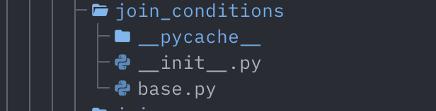
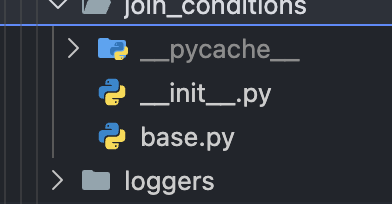

# svgtree.nvim

**Use VS Code SVG file icons in Sprite's native Explorer or terminal Neovim.**

Sprite opens a native, resizable Explorer beside Neovim. Ordinary Neovim keeps
the terminal tree and its image or text icon fallback. The native tree uses a
pinned Material Icon Theme and Dark Modern colors by default; the terminal tree
keeps the bundled starter icons unless you choose a pack.

## Native Explorer in Sprite

The VS Code-like Explorer is available when Neovim runs inside
[Sprite](https://github.com/HundredBillion/sprite.nvim). Sprite supplies the
native, resizable sidebar; svgtree supplies the VS Code-style layout, system
font, spacing, Material icons, tree state, and navigation. In Ghostty or any
other terminal, the same configuration automatically uses svgtree's terminal
renderer instead.


### LazyVim setup

Add this file to your LazyVim configuration. LazyVim keeps its dashboard,
Snacks Explorer, and `<leader>e` mapping. Svgtree adds its own commands and
does not need to know which explorer or dashboard your distribution uses.

```lua
-- ~/.config/nvim/lua/plugins/svgtree.lua
return {
  {
    "HundredBillion/svgtree.nvim",
    opts = {},
    cmd = { "SvgTree", "SvgTreeToggle" },
  },
}
```

Use `:SvgTree` to open the tree and `:SvgTreeToggle` to close or reopen it.
Install [Sprite](https://github.com/HundredBillion/sprite.nvim) separately if
you want its native sidebar; add it as a dependency in the spec above if you
lazy-load both plugins. The first file selected from a dashboard opens in the
main editor window. Other special windows remain intact.

If you want `<leader>e` to toggle svgtree instead of Snacks Explorer, opt in
by adding a native close mapping to the plugin spec and an editor mapping to
`~/.config/nvim/lua/config/keymaps.lua`. With LazyVim's default Space leader:

```lua
-- In the svgtree plugin spec above, replace opts = {} with:
opts = { native = { mappings = { ['<Space>e'] = 'close' } } },
```

```lua
-- ~/.config/nvim/lua/config/keymaps.lua
vim.keymap.set('n', '<leader>e', '<cmd>SvgTreeToggle<cr>', { desc = 'Toggle svgtree' })
```

The editor mapping overrides LazyVim's `<leader>e` only when you add it. Sprite
handles its own keys while the native sidebar has focus, so the matching
`<Space>e` action closes it there. The terminal tree receives the Neovim
mapping directly.

Install `svgtree.nvim` and put the optional `sprite.nvim` plugin API on
Neovim's runtime path for native Sprite support. Ordinary Neovim needs only
`svgtree.nvim`. Call `require('svgtree').setup({})` and open it with
`:SvgTree [dir]` or `:SvgTreeToggle [dir]`. Sprite chooses the native view when
its dock features are available. `renderer = 'sprite'` requests native and
reports the reason when it must fall back; `renderer = 'terminal'` always uses
the terminal tree. A failed native open preserves the editor's unsaved buffers
and opens the terminal tree for the same root.

For an isolated checkout demo, first materialize the visual fixture and set
explicit checkout paths:

```bash
python3 tests/visual/generate_fixture.py project /tmp/svgtree-visual-project --revision final
export SVGTREE_CHECKOUT="$PWD"
export SVGTREE_API_CHECKOUT=/absolute/path/to/sprite.nvim
export SVGTREE_FIXTURE=/tmp/svgtree-visual-project
sprite -e nvim -u "$SVGTREE_CHECKOUT/scripts/native-demo-init.lua"
# Alternatively, launch with the plugin's own Neovim wrapper:
sprite -e "$SVGTREE_API_CHECKOUT/bin/sprite-nvim" -u "$SVGTREE_CHECKOUT/scripts/native-demo-init.lua"
```

The demo init changes only that Neovim process. The native width is measured in
logical pixels (`native.width = 280` by default); the terminal width is measured
in cells (`window.width = 36`). The demo uses 290 logical pixels to match the
recorded reference; set `SVGTREE_NATIVE_WIDTH` for another capture width. Both
trees show dotfiles by default; set
`show_hidden = false` to hide them, including during search and auto-reveal.
The native tree watches the root and expanded directories, refreshes external
changes, and reveals the active file. It keeps expansion, selection, scroll,
and separate native/terminal widths for a root during the Neovim session.

Native keys: `j`/`k` or arrows move; `h`/`l` collapse and enter; `gg`/`G`
move to the ends; `<C-d>`/`<C-u>` scroll; `/` searches filenames literally;
`n`/`N` move between matches; `.` focuses the selected directory (or a file's
directory); `<BS>` moves the root to its parent; `R` refreshes; `q` or `<Esc>`
closes. `<CR>` opens a file and focuses the editor. For a left sidebar,
`<C-l>`, `<C-w>l`, and `<C-w><C-l>` also focus the editor; use the matching
`h` forms for a right sidebar. A single click opens a file while keeping tree
focus; a double click focuses the editor. Set
`native.mappings` to map a key to an action or `false` to remove it, for
example:

```lua
require('svgtree').setup({ native = { mappings = { ['<Space>'] = 'enter', j = false } } })
```

Because a native sidebar is not a Neovim split, editor-side window mappings
can call `focus(side)` before falling back to `:wincmd`. If you choose to map
`<C-h>`/`<C-l>` for navigation in both directions:

```lua
local tree = require('svgtree')
local function focus(side, wincmd)
  return function()
    if not tree.focus(side) then vim.cmd('wincmd ' .. wincmd) end
  end
end
vim.keymap.set('n', '<C-h>', focus('left', 'h'))
vim.keymap.set('n', '<C-l>', focus('right', 'l'))
```

The command interface works without any keymap. If you choose a shortcut of
your own, map `:SvgTreeToggle` in Neovim and the matching `close` action in
`native.mappings` when using Sprite's native sidebar.

See [visual acceptance](tests/visual/acceptance.md) for reference captures and
the current platform and manual verification status.

## The problem this solves

I've always been bothered that I can't use my favorite VSCode SVG file icons in Neovim.

Why can't we use svg icons in Neovim? Because terminals can't display SVG. So we're stuck with font glyphs, which can only render a boring one-color icon. The blue-and-yellow Python logo, the colorful Material icons, the whole VSCode look is impossible... until now.

svgtree.nvim fixes that. It renders the **actual SVG icons as real, full-color images**, welded to each line of the tree, using the Kitty graphics protocol. Install it and your VSCode icons show up in Neovim — no GUI required.

#### Before — font glyphs



#### After — real SVG icons



> The terminal image path uses Neovim's experimental `vim.ui.img` capability probe.

## Install

**Terminal image prerequisites** — the terminal renders image icons when all three are present. Otherwise it uses text tags such as `[python] foo.py`. Sprite's native icons do not need these terminal prerequisites.

- **Neovim ≥ 0.13** — currently nightly. Install it and launch it as `nvim-nightly`.
- **A terminal that speaks the Kitty graphics protocol** — [Ghostty](https://ghostty.org/), [Kitty](https://sw.kovidgoyal.net/kitty/), or [WezTerm](https://wezfurlong.org/wezterm/).
- **An SVG → PNG converter** — `rsvg-convert` (recommended, renders fonts reliably): `brew install librsvg`. ImageMagick (`magick`) also works.

**The plugin** — with [lazy.nvim](https://github.com/folke/lazy.nvim), create a new file at `~/.config/nvim/lua/plugins/svgtree.lua` containing:

```lua
-- ~/.config/nvim/lua/plugins/svgtree.lua
return {
  "HundredBillion/svgtree.nvim",
  opts = {},
  cmd = { "SvgTree", "SvgTreeToggle" },
}
```

(lazy.nvim auto-loads every `.lua` file under `~/.config/nvim/lua/plugins/`, so the filename is up to you — `svgtree.lua` just keeps things tidy.)

No default keymap is set — bind `:SvgTreeToggle` to whatever key you like, e.g. add `keys = { { "<leader>t", "<cmd>SvgTreeToggle<cr>", desc = "Toggle svgtree" } }` to the spec above.

The terminal tree gets the bundled starter set. For a custom theme, see [Icon packs](#icon-packs) below.

## Use it

1. Open a project using the nightly Neovim variant:

   ```bash
   nvim-nightly .
   ```

2. Open the tree:

   ```vim
   :SvgTree
   ```

   Already using the snacks.nvim explorer? You don't need svgtree's tree —
   wire the adapter (see [Use the icon engine in snacks.nvim / neo-tree](#use-the-icon-engine-in-snacksnvim--neo-tree))
   and your icons appear in the explorer you already open (e.g. `<leader>e`).

3. **You should see your icons!**

If you see text tags (`[python] foo.py`) instead of images, run `:checkhealth svgtree` — it tells you exactly which prerequisite above is missing.

Inside the tree:

| Key | Action |
|---|---|
| `<CR>` / `l` | Expand/collapse a directory, or open a file |
| `h` | Collapse the directory under the cursor |
| `.` / `<BS>` | Make the selected directory the root / move the root to its parent |
| `R` | Refresh |
| `q` | Close |

Commands: `:SvgTree [dir]` opens the tree (defaults to cwd); `:SvgTreeToggle [dir]` toggles it.
Opening or changing the root also changes Neovim's global working directory. Closing and reopening the tree keeps that root, and searches that use the working directory follow it.

## Icon packs

svgtree reads **VS Code file-icon themes directly**. It bundles the original
terminal starter set and Material Icon Theme 5.38.1 for the native default.
An explicit `pack` selection applies to both renderers. Theme association keys
can match a filename or its immediate parent and filename, case insensitively.

**Install a theme** (needs `curl` + `unzip`):

```bash
scripts/install-theme.sh PKief.material-icon-theme material
scripts/install-theme.sh vscode-icons-team.vscode-icons vscode-icons
```

These fetch the theme's `.vsix` from [Open VSX](https://open-vsx.org/) and unpack it to `stdpath('data')/svgtree/packs/<name>/`. Then select it:

```lua
require("svgtree").setup({ pack = "material" })
```

**Bring your own:** point `pack` at any unpacked VSCode icon-theme directory — including one already under `~/.vscode/extensions/`:

```lua
require("svgtree").setup({ pack = "/abs/path/to/an/unpacked/icon-theme" })
```

No import or conversion step — svgtree reads the theme's `iconDefinitions` plus its `fileExtensions`/`fileNames`/`folderNames` mappings directly. (VSCode `languageIds`, light/high-contrast variants, and font-based icons are not used.)

## Configuration

Defaults:

```lua
require("svgtree").setup({
  pack = nil,            -- nil = native Material / terminal starter; a name or absolute pack path overrides both
  icon = {
    width = 2,           -- icon footprint in cells
    height = 1,
    size_px = 40,        -- rasterized PNG size
    zindex = 50,
  },
  window = { width = 36, side = "left" },
  indent = 2,
  show_hidden = true,   -- show dotfiles; explicit false also applies to search and reveal
  renderer = "auto",    -- auto | sprite | terminal
  native = { width = 280, compact_folders = true, mappings = {} }, -- logical pixels
  fallback_text = true,  -- show [id] tags when images are unavailable
})
```

## Use the icon engine in snacks.nvim / neo-tree / bufferline

svgtree's icon machinery is a **host-agnostic engine** you can attach to an existing explorer — or the bufferline tabline — to get real SVG icons there, no need to switch to svgtree's own tree. Call `require("svgtree").setup({})` once, then wire an adapter.

### snacks.nvim explorer

The adapter suppresses snacks' own glyph (keeping git/diagnostic decorations) and overlays an anchored image in its place.

```lua
-- lua/plugins/snacks.lua
opts = {
  picker = {
    sources = {
      explorer = {
        format  = require("svgtree.adapters.snacks").format,
        on_show = require("svgtree.adapters.snacks").on_show,
      },
    },
  },
}
```

### neo-tree.nvim (experimental)

```lua
require("neo-tree").setup({
  default_component_configs = {
    icon = { provider = function(icon)        -- blank neo-tree's glyph, keep width
      icon.text, icon.highlight = "  ", "NeoTreeFileIcon"
    end },
  },
  event_handlers = {
    { event = "after_render", handler = require("svgtree.adapters.neotree").on_render },
  },
})
-- If the icon lands a cell off, tune it:
-- require("svgtree.adapters.neotree").setup({ col_offset = 1 })
```

### fyler.nvim (experimental)

Fyler remains the editable terminal-buffer file manager; this adapter overlays
its icon cells with svgtree SVGs. It requires Fyler's custom icon-provider
support. Set up Fyler first, then register the adapter:

```lua
local fyler_icons = require("svgtree.adapters.fyler")

require("fyler").setup({
  integrations = {
    icon = fyler_icons.icon,
  },
})
fyler_icons.setup()
```

In a terminal with Kitty graphics support (including Ghostty), Fyler's icon
slots render svgtree images. Without image support, Fyler keeps its normal text
layout. Sprite's embedded Neovim grid is not currently a Kitty-graphics
terminal, so it needs Sprite-side image-placeholder support before this adapter
can display SVG icons inside Sprite.

### bufferline.nvim (tabs)

Show each buffer's icon on its tab, matching the explorer. The tabline isn't a buffer, so this adapter doesn't use the overlay engine — it returns the icon as Kitty placeholder text + a highlight whose foreground colour carries the image id, via bufferline's `get_element_icon` hook. Ghostty renders these placeholders directly. Sprite Terminal also needs a build with [Kitty Unicode-placeholder rendering](https://github.com/HundredBillion/Sprite/pull/38); older Sprite builds show placeholder glyphs in bufferline. Sprite's native Explorer uses SVG assets independently. The separate `sprite-nvim` native-grid launcher does not yet render Kitty image placeholders in its Neovim tabline.

```lua
-- LazyVim: ~/.config/nvim/lua/plugins/bufferline.lua
return {
  {
    "akinsho/bufferline.nvim",
    dependencies = { "HundredBillion/svgtree.nvim" },
    opts = function(_, opts)
      local adapter = require("svgtree.adapters.bufferline")
      adapter.setup()
      local fallback = opts.options.get_element_icon
      opts.options.color_icons = true
      opts.options.offsets = opts.options.offsets or {}
      table.insert(opts.options.offsets, {
        filetype = "svgtree",
        text = "SVGTree",
        highlight = "Directory",
        text_align = "left",
      })
      opts.options.get_element_icon = function(element)
        local icon, highlight = adapter.get_element_icon(element)
        if icon then return icon, highlight end
        if fallback then return fallback(element) end
      end
      return opts
    end,
  },
}
```

Keep your existing svgtree setup, restart `nvim` in Sprite Terminal or Ghostty, and open a file so bufferline displays its name and icon. The image adapter requires the same terminal graphics prerequisites as the tree. When they're unavailable, the existing LazyVim icon callback remains in use. The `svgtree` offset keeps Ghostty's bufferline tabs aligned with editor windows when the tree is open; Sprite's native Explorer sits outside Neovim's window grid, so that offset is unused there.

## How it works

The hard part of putting an image in a text buffer is keeping it welded to its line: absolute screen placement (what [`vim.ui.img`](https://github.com/neovim/neovim/pull/37914) does) isn't anchored to text, so a redraw wipes it and a scroll leaves it behind. svgtree sidesteps that by drawing through the Kitty graphics protocol's **Unicode-placeholder** mechanism — each icon is transmitted once, then drawn as ordinary buffer cells the terminal paints the image over. Because the anchor *is* buffer text, the icon scrolls with its line and repaints on every redraw for free.

1. **Resolve** each file/dir to an icon stem (`icons.lua`).
2. **Rasterize** that stem's SVG to a cached PNG at cell size (`raster.lua`, via rsvg-convert/ImageMagick). Each `(stem, size)` is converted at most once and reused from disk.
3. **Transmit + place** (`kitty.lua`): send each unique icon's PNG to the terminal once and create a *virtual* Unicode-placeholder placement for it.
4. **Anchor** (`engine.lua`): for each visible line, draw the icon as an overlay extmark whose virtual text is Kitty placeholder cells (U+10EEEE). The terminal paints the image over those cells; since they're buffer text, the icon moves and repaints on its own. This engine is shared by svgtree's own tree (`render.lua`) and the snacks/neo-tree adapters, with a `winlock` seam keeping the window from panning sideways so icons never slide off their anchor column.

`vim.ui.img` is still used — but only as the capability probe that gates on the 0.13+ runtime.


## Credits

Born from a deep-dive into whether VSCode-style SVG icons are possible in terminal Neovim. Built on [`vim.ui.img`](https://github.com/neovim/neovim/pull/37914) by [@chipsenkbeil](https://github.com/chipsenkbeil) and the Neovim team.

The bundled Material icons are [Material Icon Theme](https://github.com/material-extensions/vscode-material-icon-theme) 5.38.1 by Philipp Kief and contributors ([MIT](https://github.com/material-extensions/vscode-material-icon-theme/blob/main/LICENSE.md)). [vscode-icons](https://github.com/vscode-icons/vscode-icons) is by the vscode-icons team (MIT); `scripts/install-theme.sh` can fetch custom packs from [Open VSX](https://open-vsx.org/).

The native disclosure chevrons are adapted from Microsoft's [Codicons](https://github.com/microsoft/vscode-codicons) ([CC BY 4.0](https://creativecommons.org/licenses/by/4.0/)); see [source and changes](assets/CODICONS-NOTICE.md).

## License

MIT © David Lee
